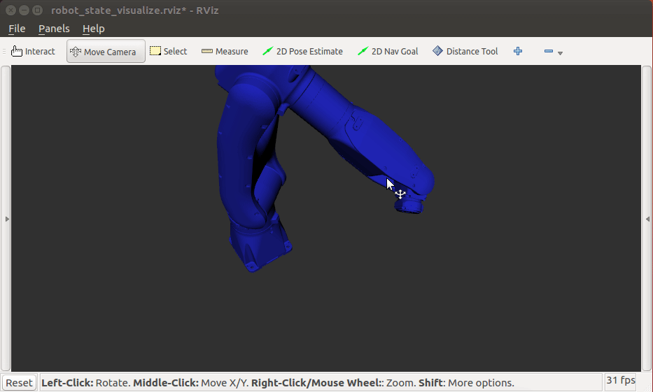

# Rviz Distance Tool
## Description
It's just the Rviz "measure tool" but with visualizations for the X, Y, and Z component of the selected vector.

Improvements welcome.

## Install

If you have ROS Kinetic+ and Rviz, you should just be able to clone and build.
